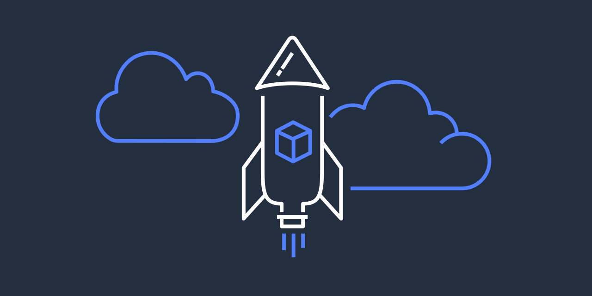

# bottlerocket-demo 🚀

Bottlerocket demo for EKS  

---

注意：
この手順には、 eksctl バージョン 0.84.0 以降が必要です。  
詳細は下記の 【To launch Bottlerocket nodes using eksctl】 をご確認ください。  
https://docs.aws.amazon.com/eks/latest/userguide/launch-node-bottlerocket.html
 
---

Bottlerocketは、
AWSが独自開発したコンテナ化されたワークロード（※EKS、ECSなど）を実行するために特別に設計された、軽量で安全な LinuxベースのオープンソースOSです。
AMIとして提供されるので、コンテナを実行するワーカーノード（ホストOS）として利用します



https://github.com/bottlerocket-os/bottlerocket

---

## デモの流れ
* 🚀 EKSクラスタ構築
* 🚀 デモアプリをデプロイ
* 🚀 デモアプリへアクセス
* 🚀 EKSクラスタ削除（後始末）

---
# デモを行う

## 🚀 EKSクラスタ構築
EKSクラスタを構築する。
```
eksctl create cluster -f eks-cluster/cluster.yaml
```
実行結果（※正常に終了）
```
2022-02-23 03:34:13 [ℹ]  eksctl version 0.84.0
2022-02-23 03:34:13 [ℹ]  using region us-west-1
2022-02-23 03:34:13 [ℹ]  setting availability zones to [us-west-1a us-west-1b]
2022-02-23 03:34:13 [ℹ]  subnets for us-west-1a - public:192.168.0.0/19 private:192.168.64.0/19
2022-02-23 03:34:13 [ℹ]  subnets for us-west-1b - public:192.168.32.0/19 private:192.168.96.0/19
2022-02-23 03:34:13 [ℹ]  nodegroup "bottlerocket-demo-ng" will use "" [Bottlerocket/1.21]
2022-02-23 03:34:13 [ℹ]  using Kubernetes version 1.21
2022-02-23 03:34:13 [ℹ]  creating EKS cluster "bottlerocket-demo2" in "us-west-1" region with managed nodes
2022-02-23 03:34:13 [ℹ]  1 nodegroup (bottlerocket-demo-ng) was included (based on the include/exclude rules)
2022-02-23 03:34:13 [ℹ]  will create a CloudFormation stack for cluster itself and 0 nodegroup stack(s)
2022-02-23 03:34:13 [ℹ]  will create a CloudFormation stack for cluster itself and 1 managed nodegroup stack(s)
2022-02-23 03:34:13 [ℹ]  if you encounter any issues, check CloudFormation console or try 'eksctl utils describe-stacks --region=us-west-1 --cluster=bottlerocket-demo2'
2022-02-23 03:34:13 [ℹ]  Kubernetes API endpoint access will use default of {publicAccess=true, privateAccess=false} for cluster "bottlerocket-demo2" in "us-west-1"
2022-02-23 03:34:13 [ℹ]  CloudWatch logging will not be enabled for cluster "bottlerocket-demo2" in "us-west-1"
2022-02-23 03:34:13 [ℹ]  you can enable it with 'eksctl utils update-cluster-logging --enable-types={SPECIFY-YOUR-LOG-TYPES-HERE (e.g. all)} --region=us-west-1 --cluster=bottlerocket-demo2'
2022-02-23 03:34:13 [ℹ]  
2 sequential tasks: { create cluster control plane "bottlerocket-demo2", 
    2 sequential sub-tasks: { 
        wait for control plane to become ready,
        create managed nodegroup "bottlerocket-demo-ng",
    } 
}
2022-02-23 03:34:13 [ℹ]  building cluster stack "eksctl-bottlerocket-demo2-cluster"
2022-02-23 03:34:14 [ℹ]  deploying stack "eksctl-bottlerocket-demo2-cluster"
2022-02-23 03:34:44 [ℹ]  waiting for CloudFormation stack "eksctl-bottlerocket-demo2-cluster"
2022-02-23 03:35:14 [ℹ]  waiting for CloudFormation stack "eksctl-bottlerocket-demo2-cluster"
2022-02-23 03:36:14 [ℹ]  waiting for CloudFormation stack "eksctl-bottlerocket-demo2-cluster"
2022-02-23 03:37:14 [ℹ]  waiting for CloudFormation stack "eksctl-bottlerocket-demo2-cluster"
2022-02-23 03:38:14 [ℹ]  waiting for CloudFormation stack "eksctl-bottlerocket-demo2-cluster"
2022-02-23 03:39:14 [ℹ]  waiting for CloudFormation stack "eksctl-bottlerocket-demo2-cluster"
2022-02-23 03:40:14 [ℹ]  waiting for CloudFormation stack "eksctl-bottlerocket-demo2-cluster"
2022-02-23 03:41:15 [ℹ]  waiting for CloudFormation stack "eksctl-bottlerocket-demo2-cluster"
2022-02-23 03:42:15 [ℹ]  waiting for CloudFormation stack "eksctl-bottlerocket-demo2-cluster"
2022-02-23 03:43:15 [ℹ]  waiting for CloudFormation stack "eksctl-bottlerocket-demo2-cluster"
2022-02-23 03:44:15 [ℹ]  waiting for CloudFormation stack "eksctl-bottlerocket-demo2-cluster"
2022-02-23 03:45:15 [ℹ]  waiting for CloudFormation stack "eksctl-bottlerocket-demo2-cluster"
2022-02-23 03:47:16 [ℹ]  building managed nodegroup stack "eksctl-bottlerocket-demo2-nodegroup-bottlerocket-demo-ng"
2022-02-23 03:47:17 [ℹ]  deploying stack "eksctl-bottlerocket-demo2-nodegroup-bottlerocket-demo-ng"
2022-02-23 03:47:17 [ℹ]  waiting for CloudFormation stack "eksctl-bottlerocket-demo2-nodegroup-bottlerocket-demo-ng"
2022-02-23 03:47:33 [ℹ]  waiting for CloudFormation stack "eksctl-bottlerocket-demo2-nodegroup-bottlerocket-demo-ng"
2022-02-23 03:47:51 [ℹ]  waiting for CloudFormation stack "eksctl-bottlerocket-demo2-nodegroup-bottlerocket-demo-ng"
2022-02-23 03:48:08 [ℹ]  waiting for CloudFormation stack "eksctl-bottlerocket-demo2-nodegroup-bottlerocket-demo-ng"
2022-02-23 03:48:25 [ℹ]  waiting for CloudFormation stack "eksctl-bottlerocket-demo2-nodegroup-bottlerocket-demo-ng"
2022-02-23 03:48:43 [ℹ]  waiting for CloudFormation stack "eksctl-bottlerocket-demo2-nodegroup-bottlerocket-demo-ng"
2022-02-23 03:49:00 [ℹ]  waiting for CloudFormation stack "eksctl-bottlerocket-demo2-nodegroup-bottlerocket-demo-ng"
2022-02-23 03:49:17 [ℹ]  waiting for CloudFormation stack "eksctl-bottlerocket-demo2-nodegroup-bottlerocket-demo-ng"
2022-02-23 03:49:35 [ℹ]  waiting for CloudFormation stack "eksctl-bottlerocket-demo2-nodegroup-bottlerocket-demo-ng"
2022-02-23 03:49:50 [ℹ]  waiting for CloudFormation stack "eksctl-bottlerocket-demo2-nodegroup-bottlerocket-demo-ng"
2022-02-23 03:50:08 [ℹ]  waiting for CloudFormation stack "eksctl-bottlerocket-demo2-nodegroup-bottlerocket-demo-ng"
2022-02-23 03:50:24 [ℹ]  waiting for CloudFormation stack "eksctl-bottlerocket-demo2-nodegroup-bottlerocket-demo-ng"
2022-02-23 03:50:44 [ℹ]  waiting for CloudFormation stack "eksctl-bottlerocket-demo2-nodegroup-bottlerocket-demo-ng"
2022-02-23 03:50:44 [ℹ]  waiting for the control plane availability...
2022-02-23 03:50:44 [✔]  saved kubeconfig as "/home/ec2-user/.kube/config"
2022-02-23 03:50:44 [ℹ]  no tasks
2022-02-23 03:50:44 [✔]  all EKS cluster resources for "bottlerocket-demo2" have been created
2022-02-23 03:50:44 [ℹ]  nodegroup "bottlerocket-demo-ng" has 3 node(s)
2022-02-23 03:50:44 [ℹ]  node "ip-xxx-xxx-xxx-xxx.us-west-1.compute.internal" is ready
2022-02-23 03:50:44 [ℹ]  node "ip-xxx-xxx-xxx-xxx.us-west-1.compute.internal" is ready
2022-02-23 03:50:44 [ℹ]  node "ip-xxx-xxx-xxx-xxx.us-west-1.compute.internal" is ready
2022-02-23 03:50:44 [ℹ]  waiting for at least 1 node(s) to become ready in "bottlerocket-demo-ng"
2022-02-23 03:50:44 [ℹ]  nodegroup "bottlerocket-demo-ng" has 3 node(s)
2022-02-23 03:50:44 [ℹ]  node "ip-xxx-xxx-xxx-xxx.us-west-1.compute.internal" is ready
2022-02-23 03:50:44 [ℹ]  node "ip-xxx-xxx-xxx-xxx.us-west-1.compute.internal" is ready
2022-02-23 03:50:44 [ℹ]  node "ip-xxx-xxx-xxx-xxx.us-west-1.compute.internal" is ready
2022-02-23 03:50:46 [ℹ]  kubectl command should work with "/home/ec2-user/.kube/config", try 'kubectl get nodes'
2022-02-23 03:50:46 [✔]  EKS cluster "bottlerocket-demo2" in "us-west-1" region is ready
```
構築したEKSクラスタを確認する。
```
kubectl get nodes

NAME                                            STATUS   ROLES    AGE     VERSION
ip-xxx-xxx-xxx-xxx.us-west-1.compute.internal   Ready    <none>   6m34s   v1.21.9
ip-xxx-xxx-xxx-xxx.us-west-1.compute.internal   Ready    <none>   6m34s   v1.21.9
ip-xxx-xxx-xxx-xxx.us-west-1.compute.internal   Ready    <none>   6m26s   v1.21.9
```
全ノード（🚀x3台）が Ready になっていればOKです。

もう少し詳しく確認してみるとワーカーノードの OS-IMAGE が、  
ちゃんと 【Bottlerocket OS 1.6.0 (aws-k8s-1.21)】 になっていることが確認できます。
```
kubectl get nodes -o wide

NAME                                            STATUS   ROLES    AGE     VERSION   INTERNAL-IP      EXTERNAL-IP     OS-IMAGE                               KERNEL-VERSION   CONTAINER-RUNTIME
ip-xxx-xxx-xxx-xxx.us-west-1.compute.internal   Ready    <none>   9m34s   v1.21.9   192.168.28.190   52.53.249.241   Bottlerocket OS 1.6.0 (aws-k8s-1.21)   5.10.93          containerd://1.5.9+bottlerocket
ip-xxx-xxx-xxx-xxx.us-west-1.compute.internal   Ready    <none>   9m34s   v1.21.9   192.168.35.196   18.144.39.104   Bottlerocket OS 1.6.0 (aws-k8s-1.21)   5.10.93          containerd://1.5.9+bottlerocket
ip-xxx-xxx-xxx-xxx.us-west-1.compute.internal   Ready    <none>   9m26s   v1.21.9   192.168.48.243   13.56.178.164   Bottlerocket OS 1.6.0 (aws-k8s-1.21)   5.10.93          containerd://1.5.9+bottlerocket
```

---

## 🚀 デモアプリをデプロイ
名前空間を作成する。
```
kubectl create namespace sock-shop

namespace/sock-shop created
```
デモアプリ（Sock Shop）をデプロイする。
```
kubectl apply -f microservices-demo/complete-demo.yaml

deployment.apps/carts-db created
service/carts-db created
deployment.apps/carts created
service/carts created
deployment.apps/catalogue-db created
service/catalogue-db created
deployment.apps/catalogue created
service/catalogue created
deployment.apps/front-end created
service/front-end created
deployment.apps/orders-db created
service/orders-db created
deployment.apps/orders created
service/orders created
deployment.apps/payment created
service/payment created
deployment.apps/queue-master created
service/queue-master created
deployment.apps/rabbitmq created
service/rabbitmq created
deployment.apps/shipping created
service/shipping created
deployment.apps/user-db created
service/user-db created
deployment.apps/user created
service/user created
```

コマンド（kubectl）でデモアプリのk8sリソース（Pod）の状態を確認する。
```
kubectl get pod -n sock-shop

NAME                           READY   STATUS    RESTARTS   AGE
carts-7c9df6fdb4-x5rzm         1/1     Running   0          6m31s
carts-db-6c6c68b747-n2p9q      1/1     Running   0          6m31s
catalogue-7c6dcb64f7-spq6v     1/1     Running   0          6m31s
catalogue-db-96f6f6b4c-6nhl9   1/1     Running   0          6m31s
front-end-7b8bcd59cb-vkzbj     1/1     Running   0          6m31s
orders-c9994cff9-gnc9d         1/1     Running   0          6m30s
orders-db-659949975f-txdfz     1/1     Running   0          6m30s
payment-8576977df5-4n9cz       1/1     Running   0          6m30s
queue-master-bbb6c4b9d-cfsqv   1/1     Running   0          6m29s
rabbitmq-6d77f74dc-6wvwr       1/1     Running   0          6m29s
shipping-5d7c4f8bbf-tpksr      1/1     Running   0          6m29s
user-846f474c46-wdb8j          1/1     Running   0          6m28s
user-db-5f68d7b558-w97g9       1/1     Running   0          6m29s
```
全ての Pod が Running になっていればOKです。

---

## 🚀 デモアプリへアクセス
デモアプリ（Sock Shop）画面へアクセスするためのURLを確認する。
```
kubectl get svc front-end -n sock-shop

NAME        TYPE           CLUSTER-IP        EXTERNAL-IP                                     PORT(S)        AGE
front-end   LoadBalancer   xxx.xxx.xxx.xxx   yyyyyy-1234567890.us-west-1.elb.amazonaws.com   80:30001/TCP   7m46s
```
Webブラウザでデモアプリ（Sock Shop）画面へアクセスする。  
http://yyyyyy-1234567890.us-west-1.elb.amazonaws.com/


ちゃんとデモアプリ（Sock Shop）が動いてますね。

---

## 🚀 EKSクラスタ削除（後始末）
最後にEKSクラスタを削除する。
```
eksctl delete cluster -f eks-cluster/cluster.yaml --wait
```
実行結果（※正常に終了）
```
2022-02-23 12:07:58 [ℹ]  eksctl version 0.84.0
2022-02-23 12:07:58 [ℹ]  using region us-west-1
2022-02-23 12:07:58 [ℹ]  deleting EKS cluster "bottlerocket-demo2"
2022-02-23 12:08:46 [ℹ]  deleted 0 Fargate profile(s)
2022-02-23 12:08:46 [✔]  kubeconfig has been updated
2022-02-23 12:08:46 [ℹ]  cleaning up AWS load balancers created by Kubernetes objects of Kind Service or Ingress
2022-02-23 12:09:54 [ℹ]  
2 sequential tasks: { delete nodegroup "bottlerocket-demo-ng", delete cluster control plane "bottlerocket-demo2" 
}
2022-02-23 12:09:54 [ℹ]  will delete stack "eksctl-bottlerocket-demo2-nodegroup-bottlerocket-demo-ng"
2022-02-23 12:09:54 [ℹ]  waiting for stack "eksctl-bottlerocket-demo2-nodegroup-bottlerocket-demo-ng" to get deleted
2022-02-23 12:09:54 [ℹ]  waiting for CloudFormation stack "eksctl-bottlerocket-demo2-nodegroup-bottlerocket-demo-ng"
2022-02-23 12:10:13 [ℹ]  waiting for CloudFormation stack "eksctl-bottlerocket-demo2-nodegroup-bottlerocket-demo-ng"
2022-02-23 12:10:33 [ℹ]  waiting for CloudFormation stack "eksctl-bottlerocket-demo2-nodegroup-bottlerocket-demo-ng"
2022-02-23 12:10:51 [ℹ]  waiting for CloudFormation stack "eksctl-bottlerocket-demo2-nodegroup-bottlerocket-demo-ng"
2022-02-23 12:11:06 [ℹ]  waiting for CloudFormation stack "eksctl-bottlerocket-demo2-nodegroup-bottlerocket-demo-ng"
2022-02-23 12:11:25 [ℹ]  waiting for CloudFormation stack "eksctl-bottlerocket-demo2-nodegroup-bottlerocket-demo-ng"
2022-02-23 12:11:43 [ℹ]  waiting for CloudFormation stack "eksctl-bottlerocket-demo2-nodegroup-bottlerocket-demo-ng"
2022-02-23 12:12:03 [ℹ]  waiting for CloudFormation stack "eksctl-bottlerocket-demo2-nodegroup-bottlerocket-demo-ng"
2022-02-23 12:12:21 [ℹ]  waiting for CloudFormation stack "eksctl-bottlerocket-demo2-nodegroup-bottlerocket-demo-ng"
2022-02-23 12:12:38 [ℹ]  waiting for CloudFormation stack "eksctl-bottlerocket-demo2-nodegroup-bottlerocket-demo-ng"
2022-02-23 12:12:39 [ℹ]  will delete stack "eksctl-bottlerocket-demo2-cluster"
2022-02-23 12:12:39 [ℹ]  waiting for stack "eksctl-bottlerocket-demo2-cluster" to get deleted
2022-02-23 12:12:39 [ℹ]  waiting for CloudFormation stack "eksctl-bottlerocket-demo2-cluster"
2022-02-23 12:12:55 [ℹ]  waiting for CloudFormation stack "eksctl-bottlerocket-demo2-cluster"
2022-02-23 12:13:14 [ℹ]  waiting for CloudFormation stack "eksctl-bottlerocket-demo2-cluster"
2022-02-23 12:13:34 [ℹ]  waiting for CloudFormation stack "eksctl-bottlerocket-demo2-cluster"
2022-02-23 12:13:51 [ℹ]  waiting for CloudFormation stack "eksctl-bottlerocket-demo2-cluster"
2022-02-23 12:14:06 [ℹ]  waiting for CloudFormation stack "eksctl-bottlerocket-demo2-cluster"
2022-02-23 12:14:26 [ℹ]  waiting for CloudFormation stack "eksctl-bottlerocket-demo2-cluster"
2022-02-23 12:14:42 [ℹ]  waiting for CloudFormation stack "eksctl-bottlerocket-demo2-cluster"
2022-02-23 12:14:42 [✔]  all cluster resources were deleted
```
※追記：  
AWSマネコンの CloudFormation > スタック で確認したところ削除に失敗（DELETE_FAILED）することがあるようです。  
その場合は、AWSマネコンから関連リソース（VPC, Subnetなど）を手動で削除してからスタックを削除してください。  

---

以上で、Bottlerocketのデモは終了です。お疲れ様でした<(_ _)>
